# InnDAP!
Serviço de genrenciamento de contas federadas para o esquema InnovaPerson.

[Conheça o Inova RS](https://www.inova.rs.gov.br/conheca-inova-rs)

## 1. Funcionalidades
* Registro de contas de usuários
* Gerenciamento multimínio
* Auto-inscrição com aprovação
* Notificação via e-mail

## 2. Arquitetura
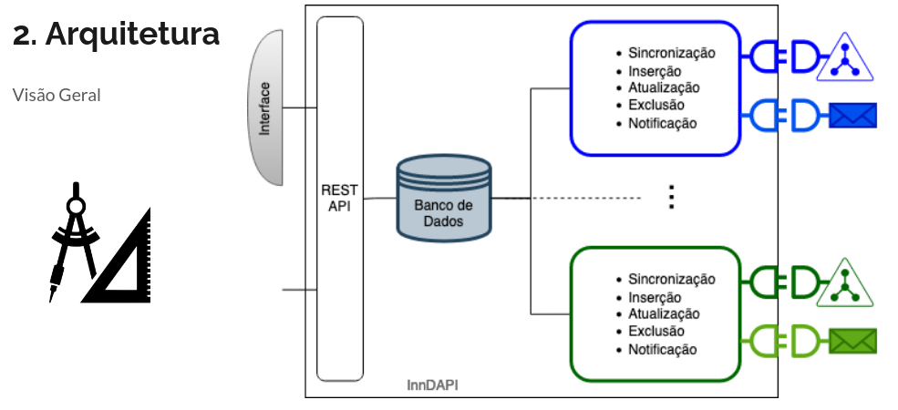
## 3. Fluxo de Operação
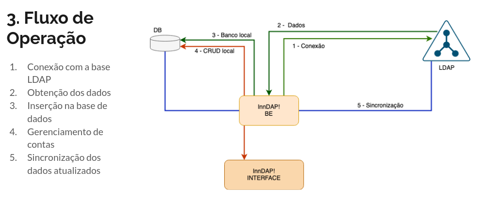
## 4. Fluxo de Auto-inscrição
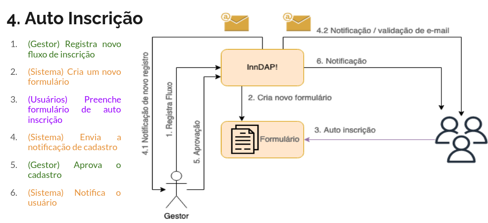
## 5. Screenshots
### 5.1. Configurações

Adicionando um domínio
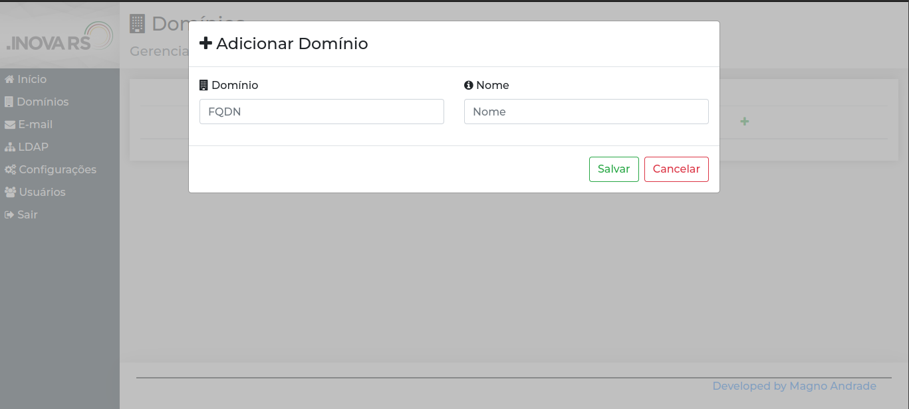
Tela de configuração para conexão com a base LDAP
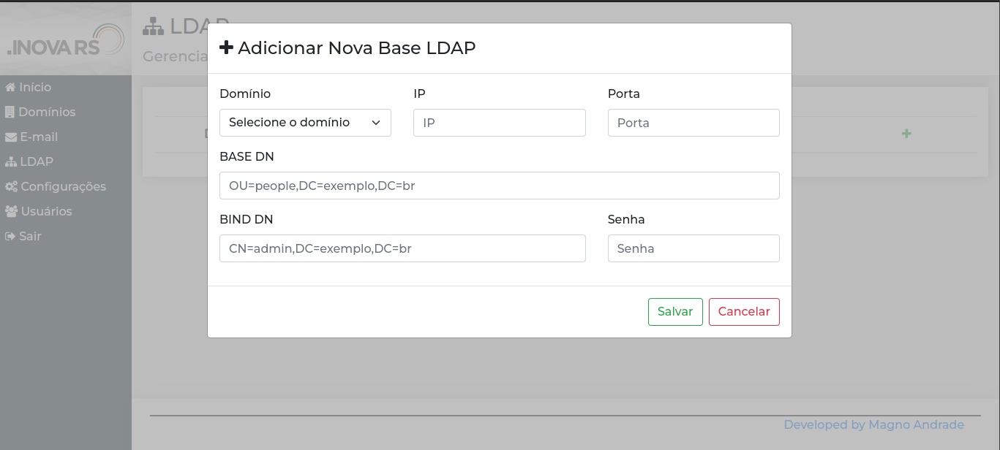
Configuração de um servidor de e-mail (por domínio) para envio de notificações
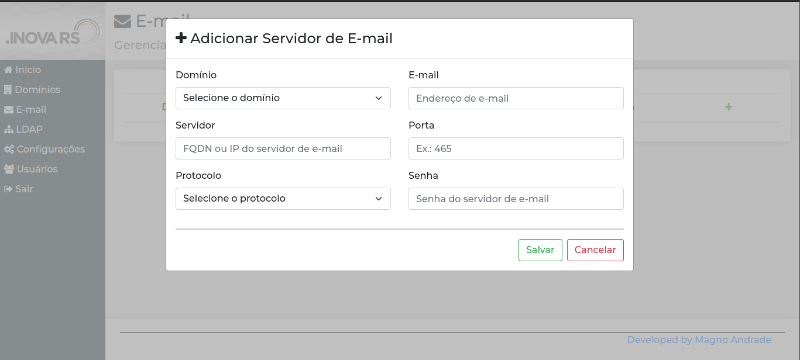
Tela de resumo de configurações por domínio
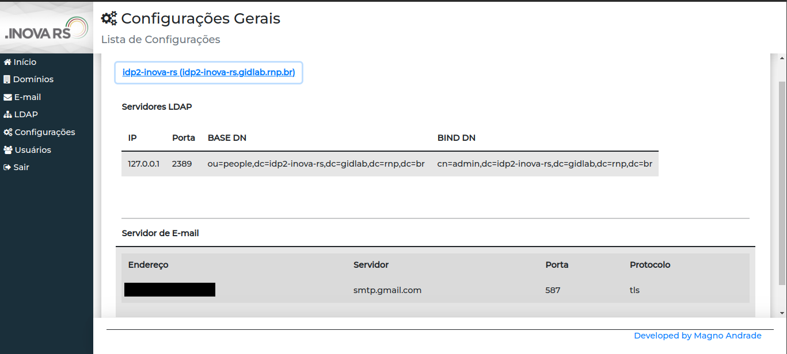
### 5.2. Gerenciamento de contas

Consulta das afiliações de um usuário registrado
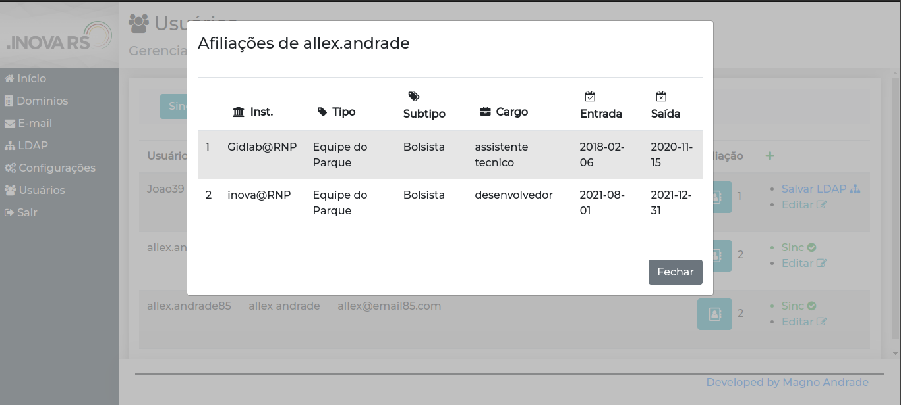
Fomulário de inclusão de usuário
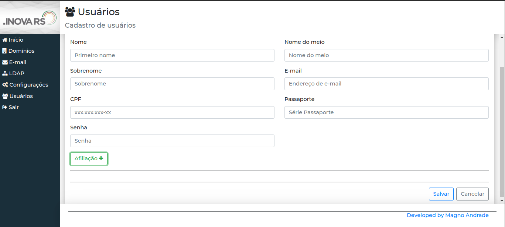
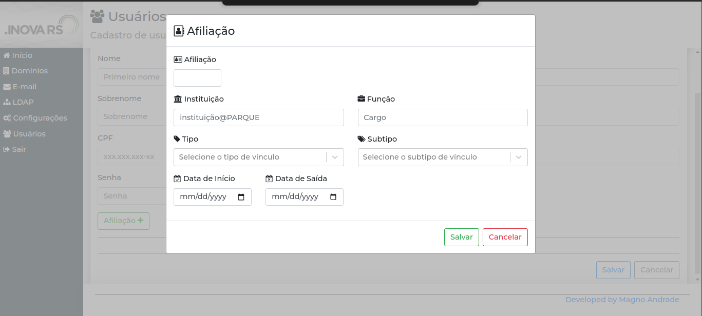
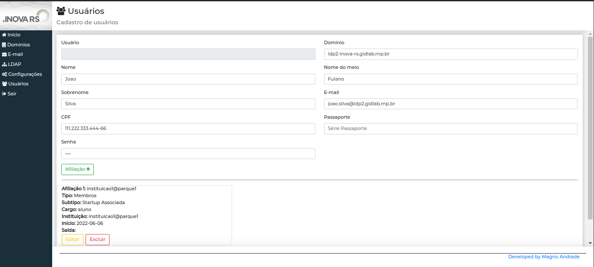
Resumo de contas registradas com usuário pronto para sincronização com  a base LDAP
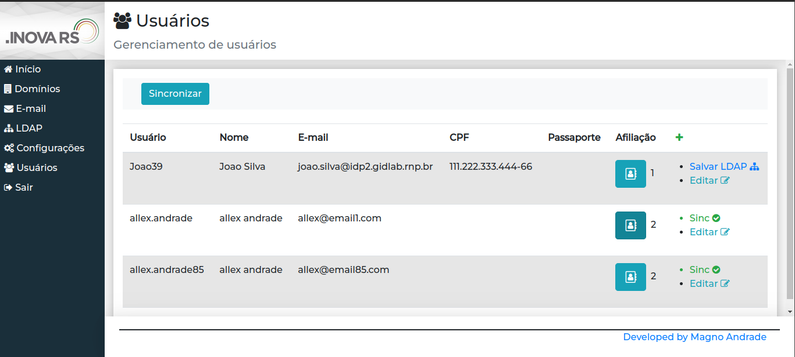
---
## Deploy

### Pré-requisitos
* [innovaLdapAPI](https://github.com/allexmagno/innovaLdapAPI)
* Node

`git clone https://github.com/allexmagno/innDAP `\
`npm install`\
`npm start`